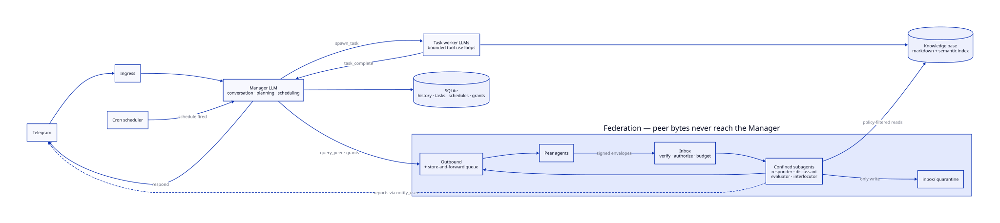

# KbaseBot

A personal AI assistant that lives in Telegram, built in **Elixir/OTP** and powered by
**Claude**. It manages a markdown knowledge base — searching it, answering from it,
journaling into it — with an agent architecture designed for long-running background
work, recurring schedules, and an encrypted-at-rest vault.

Bring your own knowledge base: the bot is generic; everything personal (content,
prompts, personality tweaks) lives in *your* data directory, not in this repo.

## Architecture

Two LLM layers with different jobs and different tools:



<sup>Diagram source: [`docs/architecture.d2`](docs/architecture.d2) —
regenerate with `d2 docs/architecture.d2 docs/architecture.svg`.</sup>

- **Manager** — owns the conversation. Decides whether to answer directly, save a
  journal entry, create a schedule, or spawn a background task. Never answers
  knowledge-base questions from memory.
- **Task workers** — spawned under a `Task.Supervisor`, run their own bounded
  tool-use loop (search / read / list over the knowledge base), and report back to the
  Manager, which surfaces the result to Telegram. The Manager stays responsive while
  tasks run.
- **Scheduler** — cron expressions persisted in SQLite; firings are injected into the
  Manager loop as system events (daily briefings, reminders, recurring queries).
- **Federation** — peer agents talk to the bot through signed envelopes, verified and
  authorized against owner-issued grants. Every peer interaction runs in a subagent
  confined to exactly that peer's clearance; its only write is a quarantine inbox, and
  peer bytes never enter the Manager loop — that's the prompt-injection boundary,
  enforced structurally rather than by prompt.
- **Tools** — every capability is a module implementing the `KbaseBot.Tool`
  behaviour, declaring which layer (`:manager`, `:task`, `:both`, `:federation`) may
  use it. Adding a capability = adding one module.

## Features

- **Knowledge-base Q&A** with built-in hybrid search over plain markdown — FTS5
  keyword search always on, fused with Voyage vector similarity when
  `VOYAGE_API_KEY` is set.
- **Journal** — timestamped daily entries written back into the knowledge base, with
  optional git auto-commit.
- **Schedules** — natural-language reminders and recurring events compiled to cron.
- **Todos** — Todoist integration.
- **Web search** — Exa-backed, for questions the knowledge base can't answer.
- **Daily briefing** — a scheduled morning message assembled from your own files
  (training plan, meals, medications — whatever your override prompt names).
- **Anthropic API discipline** — prompt caching, retry with backoff, token-cost
  awareness in the agent loops.
- **Encrypted vault workflow** — the knowledge base is designed to be tracked as
  [age](https://age-encryption.org)-encrypted blobs with hashed filenames and
  decrypted only on the deployment host (encryption scripts live with the deployment,
  not in this repo).
- **Federation** — your bot talks to your friends' bots: scoped grants
  (deny-by-default, signed delegation records), queries and multi-turn discussions,
  subscriptions, key rotation, store-and-forward delivery, per-peer inference
  budgets, and a disclosure ledger. Two-instance demo: `mix kbase_bot.demo`.

## Prompts & personality

Default prompts ship in `priv/prompts/` (the default personality is inspired by
Hanekawa from *Monogatari* — quietly competent, honest, concise). Any deployment can
override any prompt without touching code: put a file with the same name in
`<knowledge_base>/prompts/` (or point `PROMPTS_DIR` somewhere else). Overrides are
read at runtime, so they can live inside your encrypted vault.

## Try it in 2 minutes

No Telegram setup, no accounts — just an Anthropic API key and
[just](https://github.com/casey/just):

```sh
export ANTHROPIC_API_KEY=sk-ant-…
just demo
```

You get a terminal chat against a bundled sample knowledge base (the personal notes
of one Quackston Fitzduck III, duck and software engineer). Ask it *"what's my
flight training today?"*, *"what am I not allowed to eat?"*, or set a reminder and
watch the scheduler fire. Console mode (`CONSOLE_MODE=true`) runs the exact same
Manager/task agent pipeline as production — only the Telegram transport is swapped
for stdin/stdout, and tools whose integrations aren't configured (Todoist, web
search, GIFs, embeddings) are simply not offered to the model.

Want web search in the demo? Export an [Exa](https://exa.ai) key alongside the
Anthropic one and the `web_search` tool appears automatically:

```sh
EXA_API_KEY=… just demo
# then: "search the web for whether ducks can actually get angel wing from bread"
```

Searches take noticeably longer than KB questions — the agent fans out to the web
and reads results — so give it time. The same pattern works for every optional
integration below: set the key, the tool shows up.

## Running it for real

Prerequisites: Elixir ~> 1.17 on OTP 27 (or skip installing anything and use
the dev shell in the flake: `nix develop`).

```sh
cp .env.example .env   # fill in: Telegram bot token + chat id, Anthropic key, etc.
mix deps.get
set -a && source .env && set +a
mix run --no-halt
```

Configuration is entirely environment-driven (`config/runtime.exs`): `REPO_PATH`
points at your knowledge-base directory, `TELEGRAM_CHAT_ID` is the single authorized
user, `PROMPTS_DIR` overrides the prompt directory, `MODEL` selects the Claude model,
`TIMEZONE`/`LOCALE` localize the bot's clock. Only the Anthropic and Telegram
credentials are required; every other integration is optional.

## Deploying with Nix

The flake builds a self-contained OTP release (ERTS included, SQLite NIF compiled
hermetically) and ships service modules for every kind of machine. One rule
everywhere: the Nix store is read-only, so the bot's writable state — SQLite db
(`DB_PATH`), knowledge base (`REPO_PATH`), tzdata cache — must live outside the
package. The modules below wire all of that for you.

**Any machine with Nix** (Linux or macOS), foreground:

```sh
set -a && source .env && set +a
export DB_PATH=~/.local/share/kbase-bot/repo.db REPO_PATH=~/my/knowledge_base
export RELEASE_DISTRIBUTION=none RELEASE_COOKIE=any   # no clustering; Nix strips the cookie
nix run github:PsicoThePato/kbase-bot -- start
```

**NixOS** — system service (dedicated user, systemd hardening):

```nix
# flake inputs: kbase-bot.url = "github:PsicoThePato/kbase-bot";
imports = [ inputs.kbase-bot.nixosModules.default ];

services.kbase-bot = {
  enable = true;
  environmentFile = "/run/secrets/kbase-bot.env";  # TELEGRAM_*, ANTHROPIC_API_KEY, …
  # federationPort = 4040; openFirewall = true;    # if federating
};
```

State lives in `/var/lib/kbase-bot`; put your (decrypted) knowledge base at
`/var/lib/kbase-bot/knowledge_base` or point `REPO_PATH` elsewhere via
`extraEnvironment`.

**MacBook or any non-NixOS Linux** — user service via
[Home Manager](https://github.com/nix-community/home-manager) (launchd agent on
macOS, systemd user unit on Linux — same options):

```nix
imports = [ inputs.kbase-bot.homeModules.default ];

services.kbase-bot = {
  enable = true;
  environmentFile = "${config.home.homeDirectory}/.config/kbase-bot/secrets.env";
  repoPath = "${config.home.homeDirectory}/personal/knowledge_base";
};
```

On Linux, `loginctl enable-linger $USER` keeps it running after logout. On macOS,
logs land in `~/.local/share/kbase-bot/kbase-bot.log`.

Releases can't run mix tasks, so generate a federation identity on a deployed
machine with the release itself:

```sh
kbase_bot eval 'KbaseBot.Identity.Keys.generate_to("/var/lib/kbase-bot/identity.json")'
```

After changing `mix.lock`, recompute the vendored-deps hash
(`nix build .#kbase-bot.mixFodDeps` and copy the `got:` value into `flake.nix`) —
a stale hash silently reuses old deps.

## Optional integrations

Each integration activates when its env var is set; without it, the related tools
are hidden from the model entirely — nothing breaks, the capability just doesn't
exist.

| Env var | Unlocks | Get a key |
|---|---|---|
| `EXA_API_KEY` | `web_search` — web questions the KB can't answer | [exa.ai](https://exa.ai) (free tier) |
| `TODOIST_API_KEY` | `create/list/complete/delete_todo` | [Todoist](https://todoist.com) → Settings → Integrations → Developer |
| `VOYAGE_API_KEY` | `search_history` / `search_tasks` — semantic search over past conversations and task results (starts the background embedder) | [voyageai.com](https://www.voyageai.com) |
| `GIPHY_API_KEY` | `send_gif` (Telegram mode only) | [developers.giphy.com](https://developers.giphy.com) |

**Knowledge-base search** is built in: markdown is chunked into SQLite (FTS5
keyword search, no external dependencies). With `VOYAGE_API_KEY` set, chunks are
also embedded and search becomes hybrid (BM25 + vector, reciprocal-rank fusion).

Tests: `mix test`. CI runs format check, compile with warnings-as-errors, and tests.

## Federation

Implemented: agent-to-agent communication between personal knowledge bases. Owners
grant peers scoped, revocable access (grants are signed delegation records; deny by
default, `private`/`medical` never grantable); peers can query, hold multi-turn
discussions, and subscribe to feeds — always through subagents confined to that
peer's clearance. Contact cards are self-signed and transport-agnostic; identities
are Ed25519 keypairs with a rotation protocol; delivery survives peer downtime via a
store-and-forward queue; per-peer monthly inference budgets keep strangers from
spending your tokens. To stand up an instance and connect with a friend, follow
[`docs/federation-guide.md`](docs/federation-guide.md); the full protocol design
(and what's deliberately deferred) is in
[`docs/multiplayer-federation.md`](docs/multiplayer-federation.md).

Watch two bots talk over real localhost HTTP — cards, grants, query/answer,
key rotation, store-and-forward across a peer restart — with no API keys needed:

```sh
mix kbase_bot.demo
```

## Roadmap

The long arc — a guardian-angel style personal model whose corpus this bot is
quietly accumulating, the three-layer memory architecture that consolidates it
into weights, and the deferred tail of federation (trust weights, gossip,
delegation chains, discovery) — is laid out in
[`docs/roadmap.md`](docs/roadmap.md).

## License

MIT
