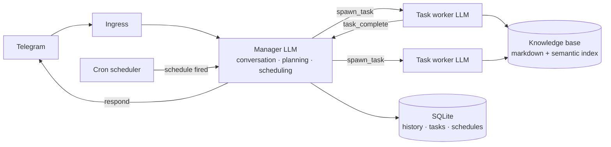

# KbaseBot

A personal AI assistant that lives in Telegram, built in **Elixir/OTP** and powered by
**Claude**. It manages a markdown knowledge base — searching it, answering from it,
journaling into it — with an agent architecture designed for long-running background
work, recurring schedules, and an encrypted-at-rest vault.

Bring your own knowledge base: the bot is generic; everything personal (content,
prompts, personality tweaks) lives in *your* data directory, not in this repo.

## Architecture

Two LLM layers with different jobs and different tools:



- **Manager** — owns the conversation. Decides whether to answer directly, save a
  journal entry, create a schedule, or spawn a background task. Never answers
  knowledge-base questions from memory.
- **Task workers** — spawned under a `Task.Supervisor`, run their own bounded
  tool-use loop (search / read / list over the knowledge base), and report back to the
  Manager, which surfaces the result to Telegram. The Manager stays responsive while
  tasks run.
- **Scheduler** — cron expressions persisted in SQLite; firings are injected into the
  Manager loop as system events (daily briefings, reminders, recurring queries).
- **Tools** — every capability is a module implementing the `KbaseBot.Tool`
  behaviour, declaring which layer (`:manager`, `:task`, `:both`) may use it. Adding a
  capability = adding one module.

## Features

- **Knowledge-base Q&A** with optional semantic search (QMD vector index; falls back
  to structured file reading) over plain markdown.
- **Journal** — timestamped daily entries written back into the knowledge base, with
  optional git auto-commit.
- **Schedules** — natural-language reminders and recurring events compiled to cron.
- **Todos** — Todoist integration.
- **Web search** — Exa-backed, for questions the knowledge base can't answer.
- **Daily briefing** — a scheduled morning message assembled from your own files
  (training plan, meals, medications — whatever your override prompt names).
- **Anthropic API discipline** — prompt caching, retry with backoff, token-cost
  awareness in the agent loops.
- **Encrypted vault workflow** — the knowledge base is designed to be tracked as
  [age](https://age-encryption.org)-encrypted blobs with hashed filenames and
  decrypted only on the deployment host (encryption scripts live with the deployment,
  not in this repo).

## Prompts & personality

Default prompts ship in `priv/prompts/` (the default personality is inspired by
Hanekawa from *Monogatari* — quietly competent, honest, concise). Any deployment can
override any prompt without touching code: put a file with the same name in
`<knowledge_base>/prompts/` (or point `PROMPTS_DIR` somewhere else). Overrides are
read at runtime, so they can live inside your encrypted vault.

## Running it

```sh
cp .env.example .env   # fill in: Telegram bot token + chat id, Anthropic key, etc.
mix deps.get
set -a && source .env && set +a
mix run --no-halt
```

Configuration is entirely environment-driven (`config/runtime.exs`): `REPO_PATH`
points at your knowledge-base directory, `TELEGRAM_CHAT_ID` is the single authorized
user, `QMD_ENABLED`/`QMD_PATH` control semantic search, `PROMPTS_DIR` overrides the
prompt directory, `MODEL` selects the Claude model.

Tests: `mix test`. CI runs format check, compile with warnings-as-errors, and tests.

## Roadmap

The interesting one: **federation** — agent-to-agent communication between personal
knowledge bases, with scoped privacy grants, per-topic trust, capability-token
transitivity, and pluggable identity. The full protocol design is in
[`docs/multiplayer-federation.md`](docs/multiplayer-federation.md).

## License

MIT
